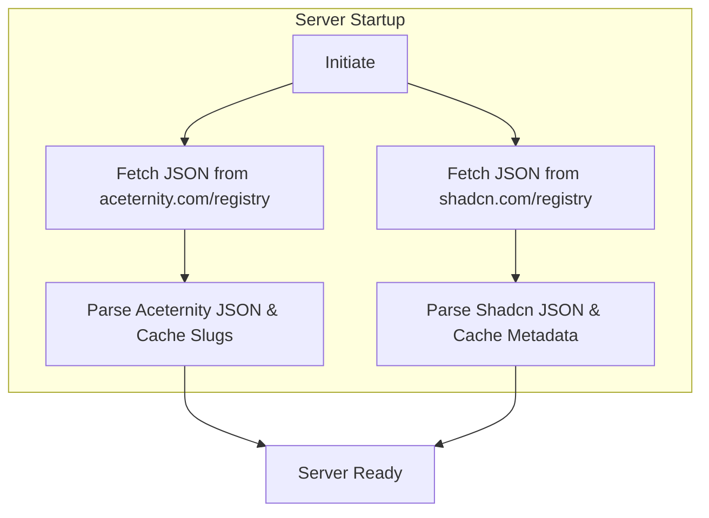
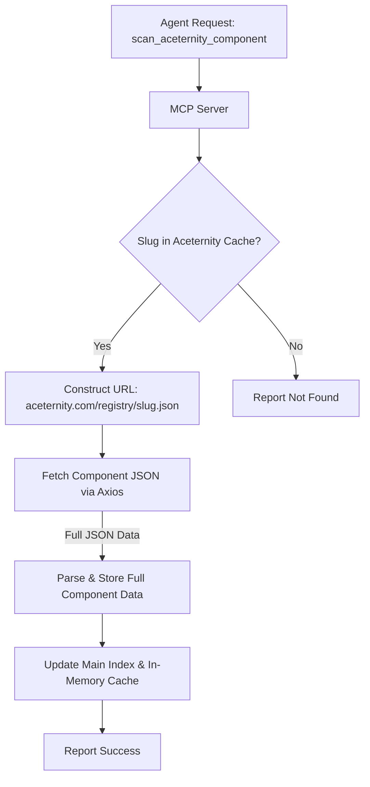
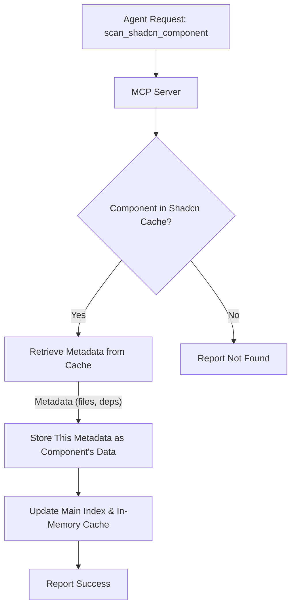

# Component Harvester MCP Server ✨

This MCP (Model Context Protocol) server is your AI agent's trusty sidekick for sourcing React components from popular UI libraries. It automates finding, fetching, and understanding how to integrate UI elements into your projects, supporting both direct code harvesting and CLI-based integration guidance.

## Supported Libraries

-   **Aceternity UI**: Full component code and metadata harvesting.
-   **Shadcn UI**: Component metadata harvesting and CLI-based integration guidance.
-   _(More to come soon!)_

## TLDR;

This server fetches component information from Aceternity UI and Shadcn UI.
-   For **Aceternity UI**, it gets the full code and dependencies.
-   For **Shadcn UI**, it gets metadata (like dependencies, files created) and tells you how to install the component using its CLI.

The server stores this information and can generate detailed prompts for an AI agent (or you!) to integrate these components.

**Example Agent Prompts:**

-   `"Fetch the '3D Pin' component from Aceternity UI and show me the code and dependencies."`
-   `"List all available components from Aceternity UI."`
-   `"Scan the 'Alert Dialog' component from Shadcn UI and show me how to integrate it."`
-   `"List all available Shadcn UI components."`

## What Can It Do? 🚀

The Component Harvester enables an AI agent to:

1.  **Discover Components**: Automatically learn about available components by fetching and parsing the main JSON registries from Aceternity UI (`https://ui.aceternity.com/registry`) and Shadcn UI (`https://ui.shadcn.com/registry`).
2.  **Fetch Component Data**:
    *   **Aceternity UI**: Grabs detailed, structured JSON data for specific components (e.g., from `https://ui.aceternity.com/registry/[slug].json`), which includes full source code, file paths, dependencies, etc.
    *   **Shadcn UI**: Retrieves metadata for specific components directly from its main registry JSON. This includes dependencies, file names, etc., but not the full source code (as Shadcn components are added via CLI).
3.  **Store Locally**:
    *   Maintains a central index (`data/harvested_index.json`) of all processed components from all sources.
    *   Stores detailed data for each component in source-specific directories:
        *   `data/aceternity/[slug].json`: Contains the full fetched JSON (including code) for an Aceternity UI component.
        *   `data/shadcn/[slug].json`: Stores the metadata (name, type, deps, file list) for a Shadcn UI component, as extracted from their main registry.
4.  **Generate Integration Blueprints**: Produces detailed, step-by-step prompts:
    *   **Aceternity UI Prompts**: Include full code, file paths, and dependency information for manual integration.
    *   **Shadcn UI Prompts**: Guide using `npx shadcn-ui@latest add [slug]`, list expected files, and dependencies.

## How It Works 🧙‍♂️

### 1. Learning the Lay of the Land: Registry Processing

When the server starts, it fetches the main registry JSON directly from both Aceternity UI and Shadcn UI.


- **The Goal**: To build internal maps (`aceternityRegistryData` and `shadcnRegistryData`) for quick lookups.
    - For Aceternity, it maps a normalized component name to its slug (e.g., "3D Pin" -> "3d-pin").
    - For Shadcn, it maps a normalized component name to its full metadata object from the registry.

### 2. The Treasure Hunt: Fetching/Processing Specific Component Data

**Aceternity UI:**
When an agent requests an Aceternity component (e.g., "3D Pin"), the server uses its cached slug.

- **Data Fetched**: The complete JSON for the component, including source code for all its files.

**Shadcn UI:**
When an agent requests a Shadcn component (e.g., "Alert Dialog"):

- **Data Processed**: The metadata (dependencies, file list, etc.) already fetched from `https://ui.shadcn.com/registry`. No individual `[slug].json` is fetched for Shadcn as it's not provided by them.

### 3. Keeping a Record: Component Storage

All processed component data is stored:
1.  **Individual JSON Files**:
    *   `data/aceternity/[slug].json`: Stores the full JSON (code, files, deps) for an Aceternity UI component.
    *   `data/shadcn/[slug].json`: Stores the metadata (name, type, deps, file list) for a Shadcn UI component, as extracted from their main registry.
2.  **Central Index File (`data/harvested_index.json`)**: A manifest of all components from all sources, with metadata like name, source, slug, description, path to its specific JSON file, and last scan time.
    ```json
    {
      "aceternity:3DPin": { /* ... metadata ... */ },
      "shadcn:AlertDialog": { /* ... metadata ... */ }
    }
    ```
An in-memory cache (`inMemoryIndexCache`) mirrors this index for fast access.

### 4. The Blueprint: Generating Integration Prompts

The `get_aceternity_component_prompt` and `get_shadcn_component_prompt` tools transform stored data into integration instructions.

-   **Aceternity UI Prompts**: Include full code, file paths, and dependency information.
-   **Shadcn UI Prompts**: Guide using `npx shadcn-ui@latest add [slug]`, list expected files, and dependencies.

## Meet the Tools: MCP Server Endpoints 🛠️

### Common Tools
-   `list_harvested_components`: Lists all components stored in the index.
    -   Input: `{ "source": "aceternity" | "shadcn" | "all" }` (optional)

### Aceternity UI Tools
-   `scan_aceternity_component`: Fetches and stores full data for an Aceternity UI component.
    -   Input: `{ "componentName": "string" }`
-   `get_aceternity_component_prompt`: Generates a detailed integration guide (with code) for a scanned Aceternity UI component.
    -   Input: `{ "componentName": "string" }`

### Shadcn UI Tools
-   `list_shadcn_components`: Lists all components available in the Shadcn UI registry cache.
    -   Input: `{}`
-   `scan_shadcn_component`: Processes and stores metadata for a Shadcn UI component from its main registry.
    -   Input: `{ "componentName": "string" }`
-   `get_shadcn_component_prompt`: Generates an integration guide (CLI-focused) for a Shadcn UI component.
    -   Input: `{ "componentName": "string" }`

## The Road Ahead: Future Enhancements 🗺️
-   **Smarter Prompt Generation**: More context-aware advice in prompts.
-   **Broader Horizons**: Adding support for more component libraries.
-   **Manual Cache Refresh**: Tools to re-trigger registry fetching on demand.
-   **Enhanced Error Handling**: Continuous improvements for robustness.

We're excited about making component integration smoother and faster!
