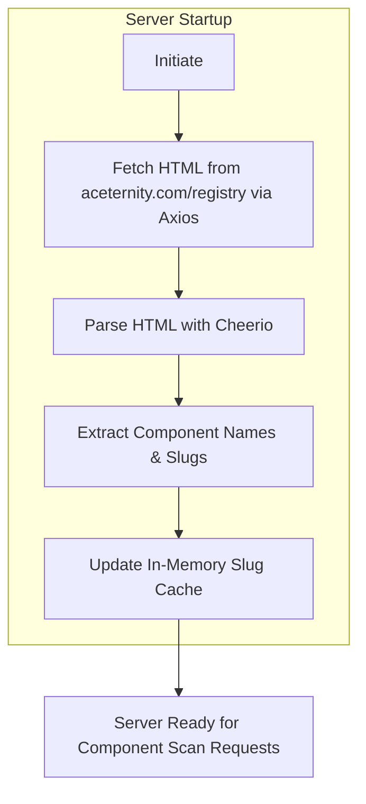
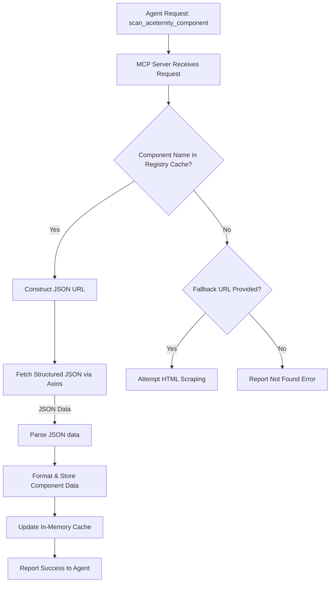
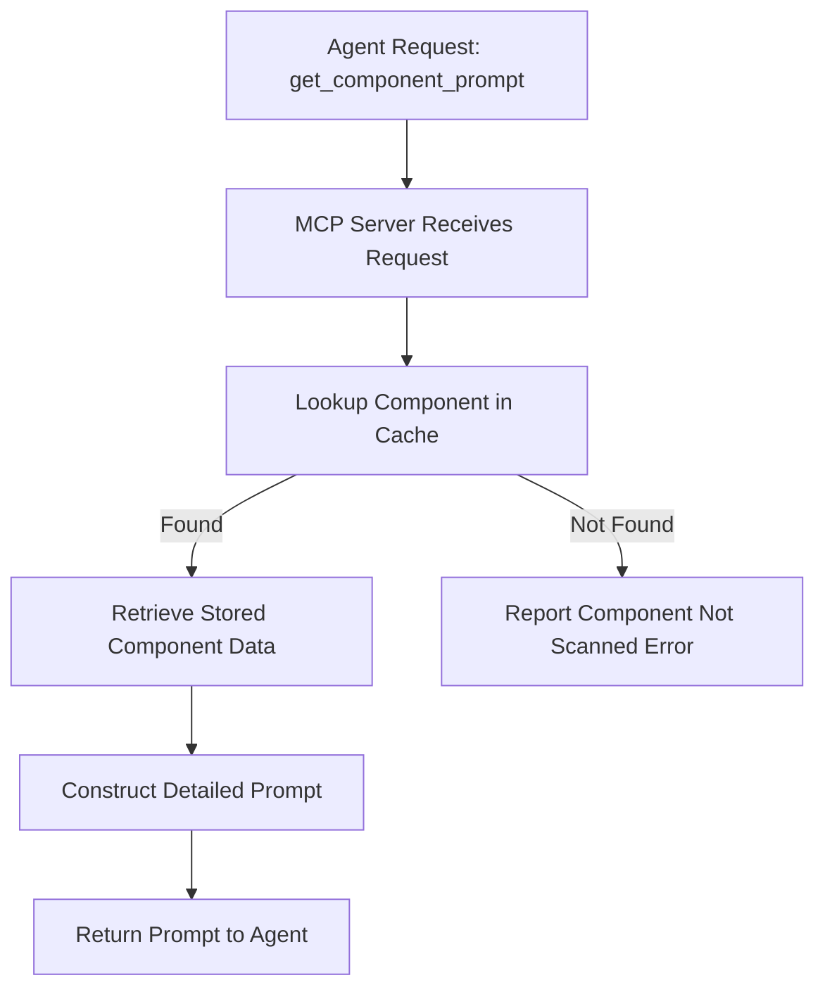

# Component Harvester MCP Server 🤖✨

Welcome to the Component Harvester! This MCP (Model Context Protocol) server is your AI agent's trusty sidekick for plucking ready-to-use React components from the web. Think of it as a smart assistant that automates the often tedious process of finding, fetching, and understanding how to integrate beautiful UI elements into your projects.

## Compatibility

- Aceternity UI
- **more to come soon!**

## TLDR;

The rest of the readme is boring, i created this to fetch components from sites like Aceternity UI. The server looks for the component, fetches the code, and then generates a prompt for the AI agent to integrate the component into the project. You can also use this prompt on any other AI agent just copy and paste the prompt into the AI agent..

Some examples of suggested prompts:

`"Fetch the button component from Aceternity UI and show me the code and dependencies."`  

`"Tell me what components are available from Aceternity UI."`

Once a component has been fetched it is stored in memory and can be used by the AI agent to generate a prompt for the user to integrate the component into their project.

## What Can It Do? 🚀

The Component Harvester enables an AI agent to:
1.  **Discover Components**: Automatically learn about available components from sources like Aceternity UI by parsing their main registry.
2.  **Fetch Rich Data**: Grab detailed information for specific components. For Aceternity UI, this means fetching structured JSON data that includes:
    *   Component name and description.
    *   Multiple code files (e.g., the component itself, demo usage).
    *   File paths for correct project structure.
    *   Dependencies (both npm and other registry components).
3.  **Store Locally**: Keep a record of all harvested components in a human-readable Markdown file (`data/harvested-components.md`) for review and persistence.
4.  **Generate Integration Blueprints**: Produce detailed, step-by-step prompts that guide the AI agent (and ultimately, you!) on how to integrate these components into a shadcn/ui, Tailwind CSS, and TypeScript project.

## The Magic Behind the Curtain: How It Works 🧙‍♂️

The server follows a sophisticated, multi-step process:

### 1. Learning the Lay of the Land: Aceternity UI Registry Parsing

When the server starts, it first visits the [Aceternity UI Registry](https://ui.aceternity.com/registry) to see what's on offer.


- **The Goal**: To build an internal map (`aceternityRegistryData`) where it knows, for example, that "3D Pin" corresponds to a slug like "3d-pin". This slug is the key to unlocking detailed data.
- **Current Status**: The HTML parsing logic for the registry page is still under development and needs refinement for robust slug extraction.

### 2. The Treasure Hunt: Fetching Specific Component Data (Aceternity UI - JSON Endpoint)

Once an agent requests a specific component (e.g., "3D Pin"), the server uses its knowledge from the registry.


- **The Power of JSON**: Aceternity UI provides detailed JSON files for each component. This is much more reliable than trying to scrape code from HTML pages!
- **Data Extracted**: Includes the official component name, description, an array of `files` (each with a `name`, `path`, and `content`), `dependencies`, and `registryDependencies`.

### 3. Keeping a Record: Component Storage

All successfully fetched and processed component data is meticulously logged in a Markdown file: `data/harvested-components.md`. This provides a persistent, human-readable record.

**Example Snippet from `data/harvested-components.md`:**
```markdown
## 3d-pin (aceternity)

- **Source JSON URL**: https://ui.aceternity.com/registry/3d-pin.json
- **Scanned**: 2025-05-09T15:20:18.307Z
- **Dependencies**: motion

### File: components/ui/3d-pin.tsx
\`\`\`tsx
"use client";
import React, { useState } from "react";
// ... (rest of the 3D Pin component code) ...
\`\`\`
---
```
An in-memory cache (`harvestedComponents`) is also maintained for immediate access by other tools during the server's current session.

### 4. The Blueprint: Generating Integration Prompts

The `get_aceternity_component_prompt` tool is the final step, transforming stored component data into actionable integration instructions for the AI agent.


- **The Prompt Includes**:
    - Verification steps for project prerequisites (shadcn/ui, Tailwind CSS, TypeScript).
    - Guidance on file placement (e.g., `components/ui/your-component.tsx`).
    - The actual code for each file associated with the component.
    - Information about dependencies.

## Meet the Tools: MCP Server Endpoints 🛠️

### 1. `scan_aceternity_component`
   - **Purpose**: To discover, fetch, and store data for a specific Aceternity UI component.
   - **Input**:
     ```json
     {
       "componentName": "string", // e.g., "3D Pin", "Sticky Banner"
       "componentURL": "string"   // Optional: Fallback URL for HTML page (less preferred)
     }
     ```
   - **Key Action**: Uses `componentName` to find a slug from the (HTML-parsed) registry cache, then constructs and fetches the component's specific `.json` file from `ui.aceternity.com/registry/SLUG.json`. Parses this JSON and stores the data.
   - **Example Agent Command**: `"Could you scan the 'Sticky Banner' component from Aceternity UI for me?"`

### 2. `list_harvested_components`
   - **Purpose**: To list all components that have been successfully scanned and stored.
   - **Input**:
     ```json
     {
       "source": "string" // Optional. Enum: ["aceternity", "all"]. Default: "all".
     }
     ```
   - **Key Action**: Currently reads from the in-memory `harvestedComponents` cache.
   - **Example Agent Command**: `"Show me all the Aceternity components you've harvested so far."`

### 3. `get_aceternity_component_prompt`
   - **Purpose**: To generate a detailed, step-by-step integration guide for a previously scanned component.
   - **Input**:
     ```json
     {
       "componentName": "string" // e.g., "3D Pin" (should match a name from a successful scan)
     }
     ```
   - **Key Action**: Retrieves the component's data from the in-memory cache and formats it into a comprehensive prompt.
   - **Example Agent Command**: `"I'm ready to add the 3D Pin. Can you give me the integration prompt?"`

## The Road Ahead: Future Enhancements 🗺️
This server is an evolving tool! Here's what's on the horizon:
- **Rock-Solid Registry Parsing**: Perfecting the Cheerio selectors for the main Aceternity UI HTML registry page to ensure all components are discovered automatically.
- **Persistent Prompt Data**: Modifying `list_harvested_components` and `get_aceternity_component_prompt` to read directly from the `data/harvested-components.md` file, so harvested data persists across server restarts.
- **Smarter Prompt Generation**: Making the `cn()` utility advice in prompts more context-aware.
- **Broader Horizons**: Adding support for HTML scraping from other component libraries that don't offer convenient JSON endpoints.
- **Manual Cache Refresh**: A dedicated tool to re-trigger the Aceternity UI registry parsing on demand.
- **Even Better Error Handling**: Because things can always go sideways on the web!

We're excited about making component integration smoother and faster for developers working with AI agents!
